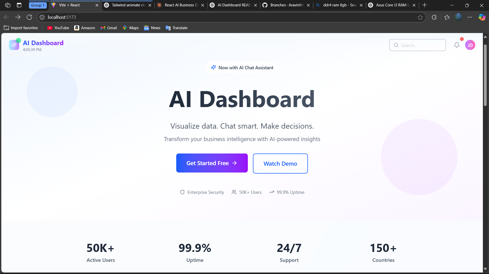
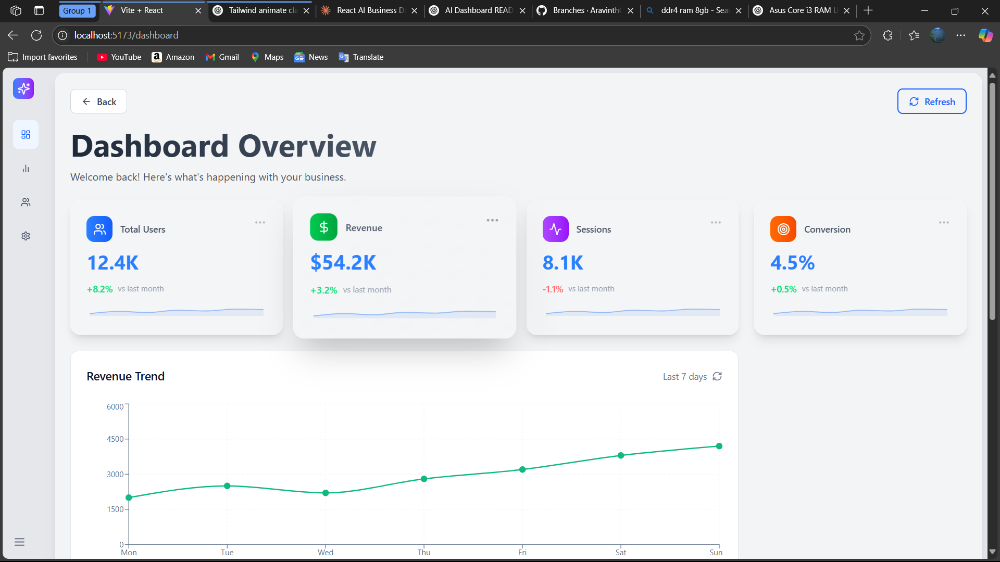
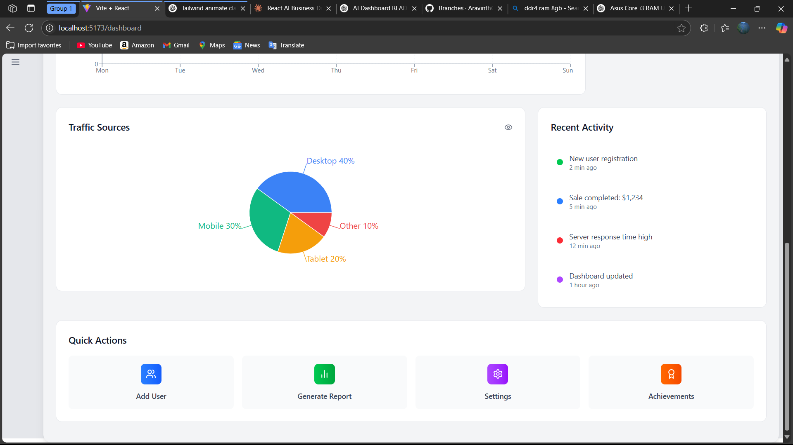
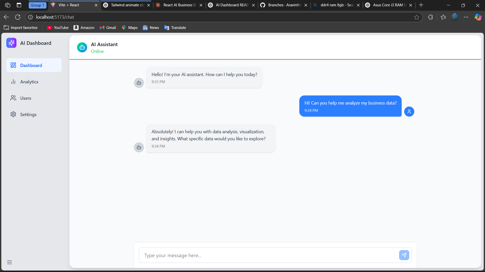

Modern AI-UI-App

A modern, responsive AI-powered dashboard built with React.js, Tailwind CSS, and Recharts. Features real-time analytics, an AI chat assistant, and beautifully designed metric cards.

🔥 Features

- 🌟 Interactive landing page with animated hero section
- 📈 Real-time charts: Line, Pie using Recharts
- 🤖 AI Chat Assistant interface
- 📊 Dynamic metric cards and recent activity feed
- 📱 Fully responsive and mobile-friendly layout
- 🎨 Clean UI with Tailwind CSS + Lucide icons

🚀 Quick Start

Clone the repository
git clone https://github.com/AravinthCM/augusta-ui-assessment.git

Navigate to project directory
cd augusta-ui-assessment

Install dependencies
npm install

Start development server
npm run dev

🧱 Tech Stack

- Frontend: React.js, Tailwind CSS, React Router
- Charts: Recharts
- Icons: Lucide React
- State Management: React Hooks (useState, useEffect)
- Responsive Design: Mobile-first, flexbox/grid

📁 Project Structure
src/
├── components/
│   ├── ui/
│   ├── layout/
│   ├── charts/
│   └── chat/
├── pages/
│   ├── Landing.jsx
│   ├── Dashboard.jsx
│   └── ChatPage.jsx
├── hooks/
│   └── useIsMobile.js
└── App.jsx

📍 Routes

| Path              | Description                  |
|-------------------|------------------------------|
| `/`               | Landing Page                 |
| `/dashboard`      | Dashboard with charts & cards |
| `/chat`           | AI Chat Assistant Interface  |

📸 Screenshots

🛠️ Available Scripts

- `npm run dev` - Runs the app in development mode

🙏 Acknowledgments
- [Recharts](https://recharts.org/) for beautiful charts
- [Lucide](https://lucide.dev/) for clean icons
- [Tailwind CSS](https://tailwindcss.com/) for utility-first styling